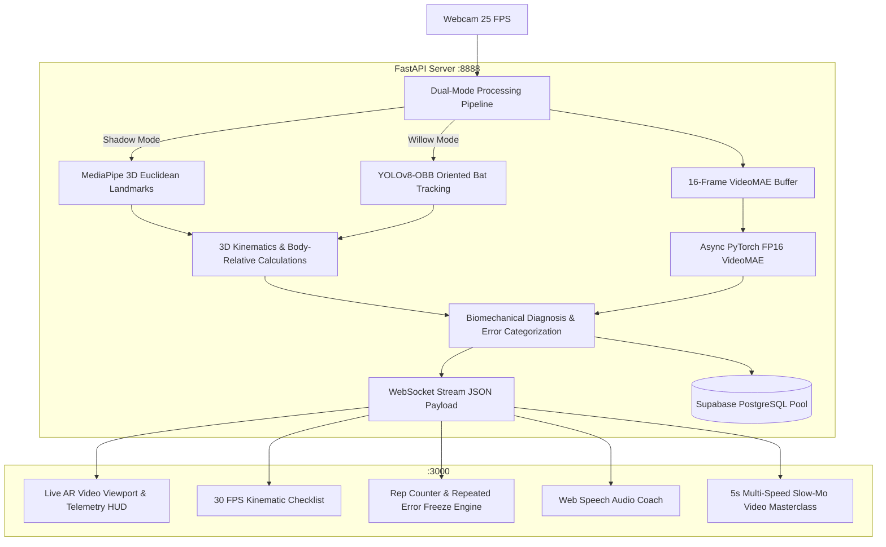

# BatCoach AI Pro v2.0
### Real-Time Cricket Batting Biomechanics, Dual-Mode YOLOv8-OBB & Neural Stroke Analytics


---

## Overview

**BatCoach AI Pro** is an enterprise-grade, full-stack batting laboratory and virtual cricket coach designed for real-time biomechanical analysis directly in the browser. Using standard webcam video, the system performs 3D Euclidean joint estimation, YOLOv8-OBB bat blade orientation tracking, kinematic swing state validation, and neural stroke classification across 10 foundational cricket shots.

Practice sessions, stroke metrics, and per-shot biomechanical telemetry are tracked in real-time, evaluated with actionable coaching cues, and persisted to a **Supabase PostgreSQL** database for long-term athlete development.

---

## Key Features & Architecture

### 1. 🥋 Dual Practice Modes
* **🥋 Shadow Practice (Lightweight Biomechanics)**: 
  * 0% YOLO overhead; runs ultra-fast 3D MediaPipe Euclidean pose estimation + VideoMAE classification.
  * Ideal for indoor shadow batting, technique drills, and low-spec machines.
* **🏏 Live Willow Practice (YOLOv8-OBB Oriented Bat Tracking)**:
  * Runs YOLOv8-OBB bat detection with oriented bounding boxes.
  * Real-time calculation of **bat blade angle relative to spine vector**, **bat-to-pad gap**, and **vertical face vs cross-bat alignment**.

---

### 2. 🎯 Real-Time Overlay HUD & 30 FPS Kinematic Checklist
* **Live Kinematic Checklist**: Direct visual pass/fail indicator displayed at 30 FPS:
  * **Lead Elbow Elevation**: $\ge 130^\circ$ on drives (`134° ✓` vs `112° (Low)`).
  * **Lead Knee Flexion**: $\le 155^\circ$ lunge into the pitch (`148° ✓` vs `168° (Stiff)`).
  * **Head-over-Knee Balance**: Distance of nose to lead knee normalized by torso height.
  * **Torso Spine Lean**: Forward trunk tilt toward delivery line.
  * **Blade Face Alignment**: Validates vertical down-the-ground presentation vs cross-bat swing.
* **Drill Technical Cue Banner**: Constant reminder of target posture pinned to top of viewport.
* **Text-to-Speech Voice Coach**: Real-time auditory guidance and intervention feedback.

---

### 3. ⛔ Strict Rep Gating & Repeated Error Intervention
* **Verified Clean Reps vs Total Swings**:
  * **Clean Reps** increment **only upon textbook execution** passing all biomechanical angle thresholds, confidence gates, and stroke classification.
  * **Total Swings** tracks every physical stroke attempt to compute true **Form Accuracy %**.
* **Automated Flaw Diagnosis**: Flaws are classified by error code (`LOW_ELBOW`, `HEAD_BEHIND_KNEE`, `STRAIGHT_KNEE`, `UPRIGHT_SPINE`, `CROSS_BAT_ON_DRIVE`, `BAT_PAD_GAP`, etc.).
* **Repeated Mistake Drill Lock**:
  * If the athlete repeats the exact same mistake consecutively ($\ge 2\times$), **the rep counter is frozen** to prevent ingraining flawed muscle memory.
  * Displays a high-contrast **Drill Intervention Banner** with direct actionable cues (`👉 ACTION: Raise your front elbow to eye level before starting downswing`).
  * Speech synthesis priority intervention.
  * Counter automatically resumes once **1 clean textbook stroke** is executed, or via manual override.

---

### 4. 📺 5-Second Slow-Mo Video Masterclass System
* **Pre-Drill Masterclass (Mandatory First-Time Gate)**:
  * Automatically pops up before the athlete starts coaching on any drill for the first time (persisted in `localStorage`).
  * 4-Phase Biomechanical Breakdown: Initial Trigger $\rightarrow$ Stride & Knee Lunge $\rightarrow$ High Elbow Impact $\rightarrow$ High Follow-Through.
* **Multi-Speed Slow-Motion Engine**:
  * Native browser hardware-accelerated playback speeds: **`0.25x Super Slow`**, **`0.5x Slow-Mo`**, **`0.75x`**, and **`1.0x Real-Time`**.
* **Repeated Error 0.25x Visual Correction**:
  * Clicking *"Watch 5s Slow-Mo Fix"* in the error banner opens the masterclass at `0.25x` speed with the specific flaw highlighted in red/amber and the corrective action shown.
* **100% Free-Tier & Offline Resilience**:
  * Direct static MP4 playback from `public/tutorials/{shot_id}.mp4` or Supabase Storage with $0 streaming cost.
  * Automatic offline **Kinematic Simulator Fallback** if no video file is present.

---

### 5. 📊 Supabase PostgreSQL Persistence
* Pooled connection management via `psycopg2`.
* Automatically records:
  * Total reps, clean reps, total physical swings, and accuracy percentage.
  * Longest clean stroke streak.
  * Session duration and timestamps.
  * Per-stroke telemetry (elbow angle, knee angle, blade angle, confidence, grade).

---

## Supported Stroke Syllabus

| Shot | Category | Target Elbow | Target Knee | Pro Blueprint | Key Biomechanical Cue |
|---|---|---|---|---|---|
| **Cover Drive** | Drives | $\ge 130^\circ$ | $\le 155^\circ$ | Virat Kohli / Babar Azam | Lead with high front elbow, head positioned over lead knee. |
| **Straight Drive** | Drives | $\ge 135^\circ$ | $\le 155^\circ$ | Sachin Tendulkar | Present full vertical bat face straight back past the bowler. |
| **Pull Shot** | Power / Cross-Bat | $\ge 120^\circ$ | $\le 160^\circ$ | Rohit Sharma | Transfer weight to back foot, full horizontal arm extension. |
| **Hook Shot** | Power / Cross-Bat | $\ge 115^\circ$ | $\le 165^\circ$ | Ricky Ponting | Pivot front hip, roll wrists downward over impact. |
| **Square Cut** | Power / Cross-Bat | $\ge 125^\circ$ | $\le 160^\circ$ | Brian Lara | Back & across, slice blade sharply through point. |
| **Lofted Drive** | Power / Cross-Bat | $\ge 140^\circ$ | $\le 150^\circ$ | MS Dhoni | Vertical swing plane with clean extension and high finish. |
| **Forward Defense** | Defensive / Technical | $\sim 110^\circ$ | $\le 150^\circ$ | Rahul Dravid | Soft hands on impact, bat presented flush with front pad. |
| **Late Cut** | Defensive / Technical | $\sim 115^\circ$ | $\le 160^\circ$ | Kane Williamson | Feather touch guidance past slips with supple wrists. |
| **Wrist Flick** | Whips & Sweeps | $\ge 125^\circ$ | $\le 155^\circ$ | VVS Laxman / KL Rahul | Snappy forearm and wrist roll through mid-wicket corridor. |
| **Sweep Shot** | Whips & Sweeps | $\ge 120^\circ$ | $\le 145^\circ$ | Joe Root | Deep back-knee crouch with flat horizontal blade sweep. |

---

## System Architecture



---

## Quick Start Guide

### Prerequisites
- **Python 3.9+** (CUDA GPU recommended for FP16 acceleration)
- **Node.js 18+** and `npm`
- Standard webcam (built-in or USB)

---

### 1. Installation

#### Clone Repository
```bash
git clone https://github.com/Arnavch2024/BattingCoach.git
cd BattingCoach
```

#### Backend Setup
```bash
pip install fastapi uvicorn torch transformers ultralytics opencv-python mediapipe psycopg2-binary pydantic
```

#### Frontend Setup
```bash
cd cricket-coach-ui
npm install
cd ..
```

---

### 2. Environment Configuration

Create or verify `cricket-coach-ui/.env.local`:

```env
DATABASE_URL=postgresql://postgres:[PASSWORD]@[HOST]:5432/postgres
NEXT_PUBLIC_API_URL=http://127.0.0.1:8888
NEXT_PUBLIC_WS_URL=ws://127.0.0.1:8888/ws
```

---

### 3. Running the Application

Launch both services simultaneously using the root runner script:

```bash
python run_coach.py
```

Or run them individually in separate terminals:

**Terminal 1 (Backend)**:
```bash
python coach_backend.py
```

**Terminal 2 (Frontend)**:
```bash
cd cricket-coach-ui
npm run dev
```

* **Landing / Home Page**: [http://localhost:3000](http://localhost:3000)
* **Live AI Coaching Studio**: [http://localhost:3000/coach](http://localhost:3000/coach)
* **FastAPI Swagger API Docs**: [http://127.0.0.1:8888/docs](http://127.0.0.1:8888/docs)

---

## Adding Custom 5-Second Tutorial Videos (Optional)

To use your own cricket technique videos with 0ms latency and 0 cloud costs, drop `.mp4` clips into:
```
cricket-coach-ui/public/tutorials/
```
Named after the shot ID:
`cover.mp4`, `straight.mp4`, `pull.mp4`, `hook.mp4`, `square_cut.mp4`, `lofted.mp4`, `defense.mp4`, `late_cut.mp4`, `flick.mp4`, `sweep.mp4`.

The player will automatically prioritize your local files with full `0.25x – 1.0x` slow-motion controls.

---

## REST & WebSocket API Reference

| Endpoint | Protocol | Description |
|---|---|---|
| `/ws` | WebSocket | Real-time biometrics, YOLO-OBB bat telemetry, VideoMAE shot probabilities, and feedback events. |
| `GET /health` | HTTP GET | Service health check, CUDA status, FP16 execution state, and Supabase DB connection check. |
| `POST /api/athlete/sync` | HTTP POST | Upserts athlete profile (name, email, stance) in Supabase `athletes` table. |
| `POST /api/sessions/save` | HTTP POST | Persists completed practice session summary and per-stroke telemetry to Supabase. |
| `GET /api/sessions/history` | HTTP GET | Retrieves historical practice sessions for an athlete. |
| `GET /api/stats` | HTTP GET | Computes aggregate career stats (total reps, clean accuracy %, best streak, practice time). |

---

## Repository Structure

```
.
├── coach_backend.py              # FastAPI WebSocket server, 3D Pose engine, YOLO-OBB, VideoMAE & Supabase pool
├── run_coach.py                  # Universal root launcher script (starts backend + frontend)
├── cricket_shot_classifier_colab.py # VideoMAE model fine-tuning & evaluation script
├── train_yolov8.py               # YOLOv8-OBB bat detector training script
├── data.yaml                     # Roboflow dataset configuration
│
├── cricket-coach-ui/             # Next.js 16 Web Application
│   ├── src/
│   │   ├── app/
│   │   │   ├── page.tsx          # Landing / Home Page with Unsplash slider & Google/Email Auth
│   │   │   ├── layout.tsx        # Root layout, fonts, and dark theme wrapper
│   │   │   └── coach/
│   │   │       └── page.tsx      # Dedicated live AI coaching studio, 30 FPS HUD & Video Masterclass
│   │   └── components/ui/        # UI component library (cards, buttons, badges, switch)
│   ├── public/
│   │   ├── bat-icon.jpg          # 3D Bat icon asset
│   │   └── tutorials/            # Local 5-second slow-mo tutorial MP4 directory ($0 streaming)
│   └── package.json              # Frontend dependencies
│
└── cricket_shot_classifier-.../  # Fine-tuned VideoMAE transformer weights
```

---

## License & Acknowledgements
* **Vision Transformer**: Fine-tuned VideoMAE via HuggingFace Transformers.
* **Pose Estimation**: Google MediaPipe 3D Euclidean World Landmarks.
* **Bat Detection**: Ultralytics YOLOv8-OBB.
* **Database**: Supabase PostgreSQL.
