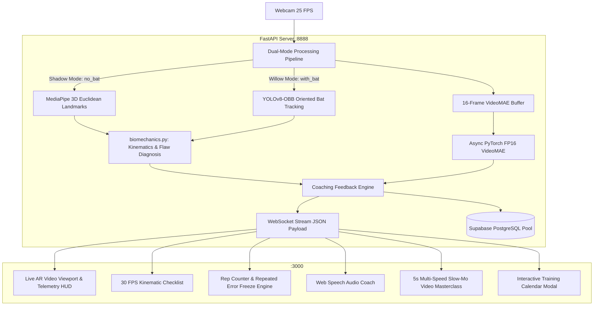

# BatCoach AI Pro v2.0
### Real-Time Cricket Batting Biomechanics, Dual-Mode YOLOv8-OBB & Neural Stroke Analytics


---

## Overview

**BatCoach AI Pro** is an enterprise-grade, full-stack batting laboratory and virtual cricket coach designed for real-time biomechanical analysis directly in the browser. Using standard webcam video, the system performs:
- **3D Euclidean joint estimation** and kinematic angle extraction via Google MediaPipe.
- **Literature-grounded biomechanical flaw detection** based on ECB coaching manuals, MCC masterclass standards, and peer-reviewed sports science (Taliep et al., Stretch et al.).
- **Dual-mode practice isolation**: 0% YOLO overhead in shadow batting vs full YOLOv8-OBB oriented bat tracking in willow mode.
- **Neural stroke classification** across 10 foundational cricket shots via a fine-tuned VideoMAE transformer.
- **Real-time feedback & repeated error gating**: Instant AR HUD cues, voice coaching, and rep freezes on recurring technique flaws.
- **Athlete telemetry & training schedule persistence** backed by Supabase PostgreSQL with strict email-scoped API security.

---

## Key Features & Architecture

### 1. 🥋 Dual Practice Modes with Clean Isolation
* **🥋 Shadow Practice (`no_bat`)**:
  * 0% YOLO overhead; runs ultra-fast 3D MediaPipe Euclidean pose estimation + VideoMAE classification.
  * Bat-specific checks (blade alignment, bat-pad gap) are cleanly bypassed (`blade_ok=True`), preventing false alerts when training without equipment.
  * Ideal for indoor shadow batting, technique drills, and resource-constrained devices.
* **🏏 Live Willow Practice (`with_bat`)**:
  * Runs YOLOv8-OBB bat detection with oriented bounding boxes.
  * Real-time calculation of **bat blade angle relative to spine vector**, **bat-to-pad gap**, and **vertical face vs cross-bat alignment**.
  * Both MediaPipe and YOLO operate on downsampled 320×240 frames for synchronized spatial awareness.

---

### 2. 🔬 Literature-Backed Biomechanical Engine (`biomechanics.py`)
All biomechanical thresholds are codified as named constants cited directly from established cricket coaching science:
* **Lead Elbow Elevation (`MIN_DRIVE_ELBOW_ANGLE = 130.0°`)**: ECB Coaching Manual standard for vertical bat drives (Cover Drive, Straight Drive).
* **Lead Knee Flexion (`MAX_DRIVE_KNEE_ANGLE = 155.0°`)**: MCC Masterclass lunge benchmark into the pitch to lower center of gravity.
* **Head-over-Knee Balance (`MAX_HEAD_KNEE_DISTANCE = 0.35`)**: Torso-normalized Euclidean distance ensuring the head remains over the ball at impact.
* **Spine Forward Lean (`MAX_DRIVE_SPINE_ANGLE = 170.0°`)**: Forward trunk inclination toward the delivery line.
* **Cross-Bat Arm Extension (`MIN_PULL_HOOK_ELBOW_ANGLE = 115.0° - 120.0°`)**: Full horizontal extension through the ball on Pull and Hook shots.
* **Deep Knee Crouch (`MAX_SWEEP_BACK_KNEE_ANGLE = 130.0°`)**: Deep back-knee flexion on the Sweep shot.
* **Robust Lead-Side Detection**: Automatic lead vs back arm/leg identification with x-coordinate geometric fallback (`is_left_lead`) when visibility scores are tied.

---

### 3. 🎯 Real-Time Overlay HUD & 30 FPS Kinematic Checklist
* **Live Kinematic Checklist**: Direct visual pass/fail indicator displayed at 30 FPS:
  * **Lead Elbow Elevation**: $\ge 130^\circ$ on drives (`134° ✓` vs `112° (Low)`).
  * **Lead Knee Flexion**: $\le 155^\circ$ lunge into the pitch (`148° ✓` vs `168° (Stiff)`).
  * **Head-over-Knee Balance**: Distance of nose to lead knee normalized by torso height.
  * **Torso Spine Lean**: Forward trunk tilt toward delivery line.
  * **Blade Face Alignment**: Validates vertical down-the-ground presentation vs cross-bat swing (active in `with_bat` mode).
* **Drill Technical Cue Banner**: Constant reminder of target posture pinned to top of viewport.
* **Text-to-Speech Voice Coach**: Real-time auditory guidance and intervention feedback using the Web Speech API.

---

### 4. ⛔ Strict Rep Gating & Repeated Error Intervention
* **Verified Clean Reps vs Total Swings**:
  * **Clean Reps** increment **only upon textbook execution** passing all biomechanical angle thresholds, confidence gates, and stroke classification.
  * **Total Swings** tracks every physical stroke attempt to compute true **Form Accuracy %**.
* **Automated Flaw Diagnosis**: Flaws are categorized by explicit error codes (`LOW_ELBOW`, `HEAD_BEHIND_KNEE`, `STRAIGHT_KNEE`, `UPRIGHT_SPINE`, `CROSS_BAT_ON_DRIVE`, `BAT_PAD_GAP`, etc.).
* **Repeated Mistake Drill Lock**:
  * If the athlete repeats the exact same mistake consecutively ($\ge 2\times$), **the rep counter is frozen** to prevent ingraining flawed muscle memory.
  * Displays a high-contrast **Drill Intervention Banner** with direct actionable cues (`👉 ACTION: Raise your front elbow to eye level before starting downswing`).
  * Counter automatically resumes once **1 clean textbook stroke** is executed, or via manual override.

---

### 5. 📺 5-Second Slow-Mo Video Masterclass System
* **Pre-Drill Masterclass (Mandatory First-Time Gate)**:
  * Automatically prompts before the athlete starts coaching on any drill for the first time (persisted in `localStorage`).
  * 4-Phase Biomechanical Breakdown: Initial Trigger $\rightarrow$ Stride & Knee Lunge $\rightarrow$ High Elbow Impact $\rightarrow$ High Follow-Through.
* **Multi-Speed Slow-Motion Engine**:
  * Native browser hardware-accelerated playback speeds: **`0.25x Super Slow`**, **`0.5x Slow-Mo`**, **`0.75x`**, and **`1.0x Real-Time`**.
* **Repeated Error 0.25x Visual Correction**:
  * Clicking *"Watch 5s Slow-Mo Fix"* opens the masterclass at `0.25x` speed with the specific flaw highlighted.
* **100% Free-Tier & Offline Resilience**:
  * Direct static MP4 playback from `public/tutorials/{shot_id}.mp4` or Supabase Storage with $0 streaming cost.
  * Automatic offline **Kinematic Simulator Fallback** if no video file is present.

---

### 6. 🛡️ Security Hardening & Lifecycle Stability
* **WebSocket Lifecycle Stability**: Frontend socket connection depends strictly on `isLive`. Mutable runtime state (`isDrillLocked`, `repeatErrorCount`, `targetShot`) is managed via React `useRef` to eliminate reconnect churn during active drills.
* **Origin & Private-Network Validation**: Strict CORS and WebSocket origin verification using normalized domain matching and private network / loopback validation via Python `ipaddress`.
* **Input Sanitization**: Control messages strictly validate `target` against registered `CLASS_NAMES` and `practice_mode` against `("no_bat", "with_bat")`.
* **Athlete Scope Enforcement**: `X-Athlete-Email` header verification across all athlete profile, session save, session history, stats, and training calendar endpoints (403 Forbidden on email scope mismatch).

---

## Supported Stroke Syllabus

| Shot | Category | Target Elbow | Target Knee | Pro Blueprint | Key Biomechanical Cue |
|---|---|---|---|---|---|
| **Cover Drive** | Drives | $\ge 130^\circ$ | $\le 155^\circ$ | Virat Kohli / Babar Azam | Lead with high front elbow, head positioned over lead knee. |
| **Straight Drive** | Drives | $\ge 135^\circ$ | $\le 155^\circ$ | Sachin Tendulkar | Present full vertical bat face straight back past the bowler. |
| **Pull Shot** | Power / Cross-Bat | $\ge 120^\circ$ | $\le 160^\circ$ | Rohit Sharma | Transfer weight to back foot, full horizontal arm extension. |
| **Hook Shot** | Power / Cross-Bat | $\ge 115^\circ$ | $\le 165^\circ$ | Ricky Ponting | Pivot front hip, roll wrists downward over impact. |
| **Square Cut** | Power / Cross-Bat | $\ge 125^\circ$ | $\le 160^\circ$ | Brian Lara | Back & across, slice blade sharply through point. |
| **Lofted Drive** | Power / Cross-Bat | $\ge 140^\circ$ | $\le 150^\circ$ | MS Dhoni | Vertical swing plane with clean extension and high finish. |
| **Forward Defense** | Defensive / Technical | $\sim 110^\circ$ | $\le 150^\circ$ | Rahul Dravid | Soft hands on impact, bat presented flush with front pad. |
| **Late Cut** | Defensive / Technical | $\sim 115^\circ$ | $\le 160^\circ$ | Kane Williamson | Feather touch guidance past slips with supple wrists. |
| **Wrist Flick** | Whips & Sweeps | $\ge 125^\circ$ | $\le 155^\circ$ | VVS Laxman / KL Rahul | Snappy forearm and wrist roll through mid-wicket corridor. |
| **Sweep Shot** | Whips & Sweeps | $\ge 120^\circ$ | $\le 145^\circ$ | Joe Root | Deep back-knee crouch with flat horizontal blade sweep. |

---

## System Architecture



---

## Quick Start Guide

### Prerequisites
- **Python 3.9+** (Python 3.10 recommended; CUDA GPU supported for FP16 acceleration)
- **Node.js 18+** and `npm`
- Standard webcam (built-in or USB)

---

### 1. Installation

#### Clone Repository
```bash
git clone https://github.com/Arnavch2024/BattingCoach.git
cd BattingCoach
```

#### Backend Setup
```bash
pip install -r requirements.txt
```
*(Or install core dependencies directly: `pip install fastapi uvicorn torch transformers ultralytics opencv-python mediapipe psycopg2-binary pydantic pytest`)*

#### Frontend Setup
```bash
cd cricket-coach-ui
npm install
cd ..
```

---

### 2. Environment Configuration

Create or verify `cricket-coach-ui/.env.local`:

```env
DATABASE_URL=postgresql://postgres:[PASSWORD]@[HOST]:5432/postgres
NEXT_PUBLIC_API_URL=http://127.0.0.1:8888
NEXT_PUBLIC_WS_URL=ws://127.0.0.1:8888/ws
```

---

### 3. Running the Application

Launch both services simultaneously using the root runner script:

```bash
python run_coach.py
```

Or run them individually in separate terminals:

**Terminal 1 (Backend)**:
```bash
python coach_backend.py
```

**Terminal 2 (Frontend)**:
```bash
cd cricket-coach-ui
npm run dev
```

* **Landing / Home Page**: [http://localhost:3000](http://localhost:3000)
* **Live AI Coaching Studio**: [http://localhost:3000/coach](http://localhost:3000/coach)
* **FastAPI Swagger API Docs**: [http://127.0.0.1:8888/docs](http://127.0.0.1:8888/docs)

---

### 4. Running the Automated Test Suite

Run the unit tests for 3D angles, biomechanical flaw detection, feedback priority, and practice modes:

```bash
# Run the complete test suite (29 tests)
python -m pytest tests/test_biomechanics.py -v
```

Validate the frontend build with Turbopack:

```bash
cd cricket-coach-ui
npm run build
```

---

## REST & WebSocket API Reference

All athlete-scoped endpoints require the `X-Athlete-Email` header to match the email specified in the payload or query parameters.

| Endpoint | Protocol | Required Headers | Description |
|---|---|---|---|
| `/ws` | WebSocket | `Origin` | Real-time biometrics, YOLO-OBB bat telemetry, VideoMAE shot probabilities, and feedback events. |
| `GET /health` | HTTP GET | — | Service health check, CUDA status, FP16 execution state, and Supabase DB connection check. |
| `POST /api/athlete/sync` | HTTP POST | `X-Athlete-Email` | Upserts athlete profile (name, email, stance) in Supabase `athletes` table. |
| `POST /api/sessions/save` | HTTP POST | `X-Athlete-Email` | Persists completed practice session summary and per-stroke telemetry to Supabase. |
| `GET /api/sessions/history` | HTTP GET | `X-Athlete-Email` | Retrieves historical practice sessions for an athlete (`?email=...`). |
| `GET /api/stats` | HTTP GET | `X-Athlete-Email` | Computes aggregate career stats (total reps, clean accuracy %, best streak, practice time). |
| `POST /api/schedule/sync` | HTTP POST | `X-Athlete-Email` | Creates or updates a training calendar event for an athlete. |
| `GET /api/schedule/list` | HTTP GET | `X-Athlete-Email` | Lists scheduled training drills and workouts for an athlete (`?email=...`). |
| `DELETE /api/schedule/{id}` | HTTP DELETE | `X-Athlete-Email` | Deletes a scheduled training drill (`?email=...`). |

---

## CI/CD & Automated Quality Gates

The repository is protected by GitHub Actions CI/CD workflows:
1. **Frontend & Biomechanics CI (`.github/workflows/ci.yml`)**:
   - Executes Python 3.10 biomechanics test suite (`pytest`).
   - Runs Next.js 16 Turbopack production build and TypeScript compilation.
   - Enforced as required status checks on the `main` branch.
2. **Weekly Dependency Security Audit (`.github/workflows/dependency-audit.yml`)**:
   - Scans Python (`pip audit`) and NPM packages for known CVEs.
   - Automatically opens a prioritized GitHub Issue when vulnerabilities are discovered.
3. **Dependabot (`.github/dependabot.yml`)**:
   - Automated monthly version updates for Python, NPM, and GitHub Actions.
   - Pinned NumPy (`<2.0.0`) for PyTorch and MediaPipe ABI stability.

---

## Repository Structure

```
.
├── biomechanics.py               # Literature-backed biomechanics constants, 3D kinematics & feedback engine
├── coach_backend.py              # FastAPI server, WebSocket hub, YOLOv8-OBB, VideoMAE & Supabase pool
├── run_coach.py                  # Universal root launcher script (starts backend + frontend)
├── tests/
│   ├── __init__.py
│   └── test_biomechanics.py      # 29-test comprehensive biomechanical unit test suite
├── .github/
│   ├── dependabot.yml            # Dependabot updates (Python, npm, GitHub Actions)
│   └── workflows/
│       ├── ci.yml                # Automated CI pipeline (Pytest + Next.js build)
│       └── dependency-audit.yml  # Weekly automated vulnerability & issue scanner
│
├── cricket-coach-ui/             # Next.js 16 Web Application (Turbopack)
│   ├── src/
│   │   ├── app/
│   │   │   ├── page.tsx          # Landing / Home Page with hero banner & athlete sync
│   │   │   ├── layout.tsx        # Root layout, fonts, and dark theme wrapper
│   │   │   └── coach/
│   │   │       └── page.tsx      # Dedicated live AI coaching studio, 30 FPS HUD & Video Masterclass
│   │   └── components/
│   │       ├── TrainingCalendarModal.tsx # Interactive training schedule & calendar
│   │       ├── CricketScrollAnimation.tsx# Dynamic interactive scroll animation
│   │       └── ui/               # UI component library (cards, buttons, badges, switch)
│   ├── public/
│   │   ├── tutorials/            # Local 5-second slow-mo tutorial MP4 directory ($0 streaming)
│   │   └── sw.js                 # Service worker for offline caching
│   └── package.json              # Frontend dependencies
│
├── train_yolov8.py               # YOLOv8-OBB bat detector training script
├── data.yaml                     # Roboflow dataset configuration
└── cricket_shot_classifier_colab.py # VideoMAE model fine-tuning & evaluation script
```

---

## License & Acknowledgements
* **Vision Transformer**: Fine-tuned VideoMAE via HuggingFace Transformers (`Arnav2005/cricket-videomae-classifier`).
* **Pose Estimation**: Google MediaPipe 3D Euclidean World Landmarks.
* **Bat Detection**: Ultralytics YOLOv8-OBB (`Arnav2005/cricket-yolov8-bat-detection`).
* **Database**: Supabase PostgreSQL.
* **Biomechanical Standards**: England and Wales Cricket Board (ECB) Coaching Guidelines, MCC Masterclass Standards, and published research by Taliep et al. & Stretch et al.
