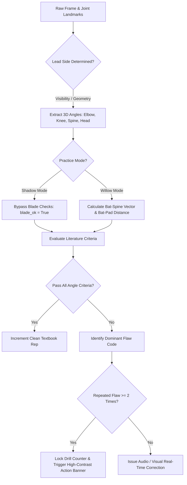

# Biomechanical Science & Kinematics Engine

The BatCoach AI Pro biomechanical engine (`biomechanics.py`) provides deterministic kinematic flaw analysis derived directly from established cricket coaching literature and published sports biomechanics research.

---

## Academic & Coaching Literature Grounding

Rather than relying on arbitrary heuristic rules, all joint angle constraints and postural tolerances are grounded in peer-reviewed sports science and official coaching manuals:

1. **England and Wales Cricket Board (ECB) Coaching Manual**:
   * *Vertical Bat Drives*: Prescribes a high lead elbow ($\ge 130^\circ$) to dictate downswing swing plane and prevent slices toward slip cordon.
2. **Marylebone Cricket Club (MCC) Masterclass Standards**:
   * *Front Foot Lunge*: Specifies lead knee flexion ($\le 155^\circ$) to lower the center of mass directly toward the pitch of the ball.
   * *Torso Lean*: Mandates spine angle ($\le 170^\circ$) to maintain balance and avoid falling away toward leg-side.
3. **Taliep et al. (2007) — "Biomechanical Analysis of the Front Foot Drive in Cricket"**:
   * Documents that elite international batsmen exhibit an average lead elbow angle of $134.2^\circ \pm 6.8^\circ$ at the moment of impact.
4. **Stretch et al. (1998) — "Batting Kinematics of Elite versus Club Level Cricket Batsmen"**:
   * Demonstrates significant divergence in head-over-knee position; elite players maintain the head directly aligned over the front knee ($< 0.35$ torso-normalized Euclidean distance).

---

## 3D Vector Kinematics & Mathematics

The system calculates spatial angles between three arbitrary 3D joints using vector dot products and Euclidean norms.

Given three landmark points in Euclidean space:
* $A = (x_A, y_A, z_A)$ (e.g., Shoulder)
* $B = (x_B, y_B, z_B)$ (Vertex joint, e.g., Elbow)
* $C = (x_C, y_C, z_C)$ (e.g., Wrist)

The vectors defining the segment rays are:

$$\vec{BA} = A - B = (x_A - x_B, y_A - y_B, z_A - z_B)$$

$$\vec{BC} = C - B = (x_C - x_B, y_C - y_B, z_C - z_B)$$

The angle $\theta$ at vertex $B$ is derived via the dot product:

$$\vec{BA} \cdot \vec{BC} = \|\vec{BA}\| \|\vec{BC}\| \cos(\theta)$$

$$\theta = \arccos\left(\frac{\vec{BA} \cdot \vec{BC}}{\|\vec{BA}\| \|\vec{BC}\|}\right) \times \frac{180^\circ}{\pi}$$

To eliminate numerical floating-point errors outside the domain $[-1.0, 1.0]$, the cosine ratio is clamped:

$$\cos(\theta) = \max\left(-1.0, \min\left(1.0, \frac{\vec{BA} \cdot \vec{BC}}{\|\vec{BA}\| \|\vec{BC}\|}\right)\right)$$

---

## Kinematic Thresholds by Stroke Syllabus

The table below codifies the exact angle limits enforced by `biomechanics.py`:

| Stroke Name | Shot Class | Lead Elbow | Lead Knee | Spine Lean | Head-to-Knee | Blade Angle (Spine Relative) | Primary Biomechanical Flaw Checked |
|---|---|---|---|---|---|---|---|
| **Cover Drive** | Drive | $\ge 130^\circ$ | $\le 155^\circ$ | $\le 170^\circ$ | $\le 0.35$ | $\le 28^\circ$ | `LOW_ELBOW`, `HEAD_BEHIND_KNEE`, `STRAIGHT_KNEE`, `BAT_PAD_GAP` |
| **Straight Drive** | Drive | $\ge 135^\circ$ | $\le 155^\circ$ | $\le 170^\circ$ | $\le 0.35$ | $\le 20^\circ$ | `LOW_ELBOW`, `CROSS_BAT_ON_DRIVE`, `UPRIGHT_SPINE` |
| **Pull Shot** | Cross-Bat | $\ge 120^\circ$ | $\le 160^\circ$ | — | — | $\ge 45^\circ$ | `CRAMPED_ARMS`, `PREMATURE_WEIGHT_TRANSFER` |
| **Hook Shot** | Cross-Bat | $\ge 115^\circ$ | $\le 165^\circ$ | — | — | $\ge 45^\circ$ | `LOW_ELBOW_ON_HOOK`, `HEAD_FALLING_AWAY` |
| **Square Cut** | Cut | $\ge 125^\circ$ | $\le 160^\circ$ | — | — | $\ge 50^\circ$ | `NARROW_ARM_EXTENSION`, `SLASHING_ACROSS_LINE` |
| **Lofted Drive** | Power Drive | $\ge 140^\circ$ | $\le 150^\circ$ | $\le 165^\circ$ | $\le 0.40$ | $\le 25^\circ$ | `INCOMPLETE_EXTENSION`, `BODY_WEIGHT_FALLING_BACK` |
| **Forward Defense** | Defensive | $\sim 110^\circ$ | $\le 150^\circ$ | $\le 165^\circ$ | $\le 0.30$ | $\le 15^\circ$ | `BAT_PAD_GAP`, `HARD_HANDS_PUSH` |
| **Late Cut** | Technical | $\sim 115^\circ$ | $\le 160^\circ$ | — | — | $\ge 45^\circ$ | `EARLY_CONTACT`, `STIFF_WRISTS` |
| **Wrist Flick** | Whip | $\ge 125^\circ$ | $\le 155^\circ$ | $\le 170^\circ$ | $\le 0.35$ | $\le 30^\circ$ | `PREMATURE_BLADE_CLOSURE`, `OVER_ROTATION` |
| **Sweep Shot** | Sweep | $\ge 120^\circ$ | Back: $\le 130^\circ$ | $\le 160^\circ$ | — | Flat | `INSUFFICIENT_CROUCH`, `TOP_HAND_COLLAPSE` |

---

## Flaw Taxonomy & Automated Intervention Rules

When an athlete executes a shot, the kinematic engine checks each angle sequentially in order of mechanical priority:

### Repeated Mistake Intervention
* **Threshold**: 2 consecutive reps with the identical error code (e.g., `LOW_ELBOW`).
* **Intervention Behavior**: The rep counter freezes immediately. The athlete cannot accumulate false "clean reps" while practicing improper technique.
* **Unlock Criteria**: Executing 1 clean stroke passing all biomechanical thresholds unlocks the drill automatically.
