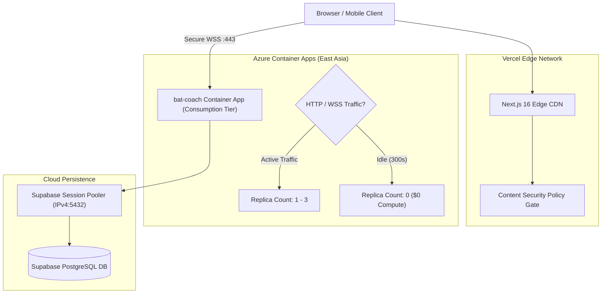
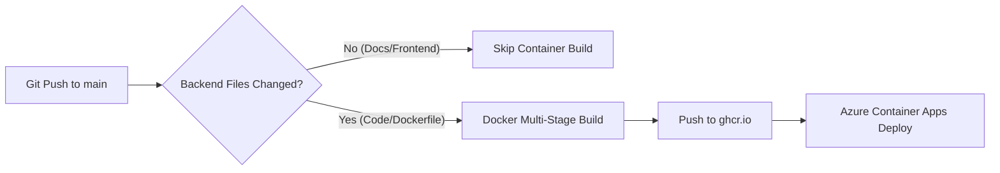

# Cloud Deployment & Scale-to-Zero Architecture


BatCoach AI Pro is architected for zero-idle-cost cloud deployment, utilizing serverless container hosting on Microsoft Azure and edge distribution on Vercel.

---

## Production Cloud Topology



---

## Azure Container Apps: Scale-to-Zero Configuration

To preserve cloud credits and eliminate idle billing:
* **Serverless Consumption Tier**: The application is deployed with `minReplicas = 0` and `maxReplicas = 3`.
* **Zero Idle Billing**: When no athlete is connected via WebSockets or REST requests, Azure scales the container count down to 0 instances after an idle timeout period, incurring **$0.00 compute charges**.
* **Cold Start & Auto-Wake**: Incoming HTTP health checks or WebSocket connection requests trigger instant container activation within seconds.
* **CPU & Memory Allocation**: 1.0 vCPU and 2.0 GiB memory allocation provides ample throughput for 30 FPS MediaPipe joint calculations and VideoMAE tensor inference.

---

## Supabase PostgreSQL: IPv4 Session Pooling

### The IPv6 DNS Resolution Challenge
Standard direct database connection strings (`db.<project-ref>.supabase.co:5432`) resolve only via IPv6 DNS records on public cloud tiers. Because Azure Container Apps and many enterprise edge networks operate in IPv4-only network namespaces, direct database connections fail with `Errno 11001: getaddrinfo failed` or connection timeouts.

### The Supavisor Solution
To guarantee universal IPv4 compatibility, BatCoach AI Pro connects exclusively through Supabase's high-performance Supavisor Session Pooler:

```
postgresql://postgres.<project-ref>:<password>@aws-0-ap-southeast-1.pooler.supabase.com:5432/postgres
```

Key pooler benefits:
1. **Universal IPv4 Resolution**: Guarantees fast, reliable resolution in all cloud container runtimes.
2. **Connection Pooling**: Handles connection churn without exhausting PostgreSQL socket limits.
3. **Automatic Schema Migration**: Database tables (`athletes`, `practice_sessions`, `stroke_telemetry_logs`, `training_schedules`) are automatically created on container startup if they do not exist.

---

## Frontend Security & Content Security Policy (CSP)

To comply with enterprise browser security standards while allowing external cloud APIs and WebSocket streaming, `cricket-coach-ui/next.config.ts` enforces a strict Content Security Policy:

```typescript
// cricket-coach-ui/next.config.ts
const ContentSecurityPolicy = `
  default-src 'self';
  script-src 'self' 'unsafe-eval' 'unsafe-inline' https://apis.google.com https://accounts.google.com https://*.datadoghq.com https://*.posthog.com https://us.i.posthog.com;
  connect-src 'self' https://*.azurecontainerapps.io wss://*.azurecontainerapps.io https://*.supabase.co https://*.datadoghq.com https://*.sentry.io https://*.posthog.com https://us.i.posthog.com;
  img-src 'self' data: blob: https:;
  style-src 'self' 'unsafe-inline' https://fonts.googleapis.com;
  font-src 'self' https://fonts.gstatic.com;
  frame-src https://accounts.google.com;
`;
```

---

## Continuous Deployment Pipeline (`build-container.yml`)

The production backend container is published to GitHub Container Registry (`ghcr.io`) and automatically deployed to Azure Container Apps on code changes:



### Path Filtering Optimization
To avoid wasting GitHub Actions runner time on non-backend changes, the build workflow runs strictly on relevant paths:
* `requirements.txt`
* `Dockerfile`
* `coach_backend.py`
* `biomechanics.py`
* Release tags (`v*.*.*`)
