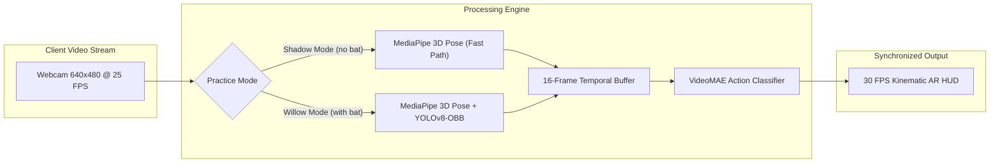

# Dual-Model Computer Vision & Neural Architecture

BatCoach AI Pro leverages a synchronized dual-model architecture designed to maintain high frame-rate edge performance while executing compute-heavy kinematic analysis and transformer video classification.

---

## Architectural Philosophy: Dual Practice Isolation

One of the key engineering innovations is the isolation between **Shadow Practice** and **Live Willow Practice**:

### 1. Shadow Practice Mode (`no_bat`)
* **0% YOLO Overhead**: Bat detection model execution is completely bypassed.
* **Lightweight Hardware Support**: Allows athletes to train indoors with bare hands or mock grip on laptops without dedicated GPUs.
* **Flaw Suppression**: Checks that rely on bat orientation (such as bat blade face presentation or bat-to-pad distance) are bypassed (`blade_ok=True`), eliminating false negative flaw alerts.

### 2. Willow Practice Mode (`with_bat`)
* **Oriented Bounding Boxes (YOLOv8-OBB)**: Traditional axis-aligned bounding boxes fail on rotating cricket bats because bounding box area balloons as the bat tilts. YOLOv8-OBB outputs rotated 5-parameter coordinates: $(x, y, w, h, \theta)$.
* **Spine-Relative Bat Blade Vector**: Computes the true angle between the longitudinal axis of the bat blade and the 3D torso spine vector $(M_{\text{mid-hip}} \rightarrow M_{\text{mid-shoulder}})$.
* **Bat-Pad Gap Analysis**: Measures pixel and Euclidean distance between the lower third of the bat blade and the lead knee/shin landmark.

---

## Model Pipeline Specifications

| Pipeline Stage | Model Architecture | Input Dimensions | Inference Target | Framework |
|---|---|---|---|---|
| **Pose Kinematics** | Google MediaPipe Pose | 320x240 RGB | 33 3D Euclidean landmarks $(x, y, z, \text{visibility})$ | MediaPipe / TFLite |
| **Bat Detection** | Ultralytics YOLOv8n-OBB | 320x240 RGB | Rotated bounding box $(x, y, w, h, \theta)$, confidence | PyTorch / ONNX |
| **Shot Classification** | VideoMAE (Vision Transformer) | 16 frames x 224x224 RGB | 10-class softmax probability distribution | HuggingFace Transformers |

---

## VideoMAE Temporal Action Recognition

To identify dynamic cricket strokes (distinguishing a Cover Drive from a Straight Drive or Forward Defense), static single-frame pose analysis is insufficient because stroke mechanics depend on momentum and temporal weight transfer.

### 16-Frame Sliding Buffer
* As video frames arrive over WebSockets, downsampled frames are appended to an asynchronous ring buffer.
* When 16 consecutive frames are accumulated, temporal uniform sampling extracts the action progression:
  1. Trigger movement and initial backlift
  2. Front foot stride and knee flexion
  3. Impact point with downswing acceleration
  4. Follow-through completion

### Classification Output Categories
The fine-tuned model (`Arnav2005/cricket-videomae-classifier`) outputs confidence across 10 core cricket strokes:
1. Cover Drive
2. Straight Drive
3. Pull Shot
4. Hook Shot
5. Square Cut
6. Lofted Drive
7. Forward Defense
8. Late Cut
9. Wrist Flick
10. Sweep Shot

---

## Inference Optimization & Resource Budgets

To achieve real-time responsiveness on serverless CPU containers:
* **Frame Downsampling**: Incoming 640x480 webcam frames are processed at 320x240 for kinematics and object detection, reducing tensor memory transfer by 75%.
* **CPU-Only PyTorch Build**: Eliminates NVIDIA CUDA runtime overhead in production, keeping Docker image size to under 1.2 GB.
* **Half-Precision (FP16) Fallback**: Automatically activates half-precision operations when running on CUDA-compatible environments.
